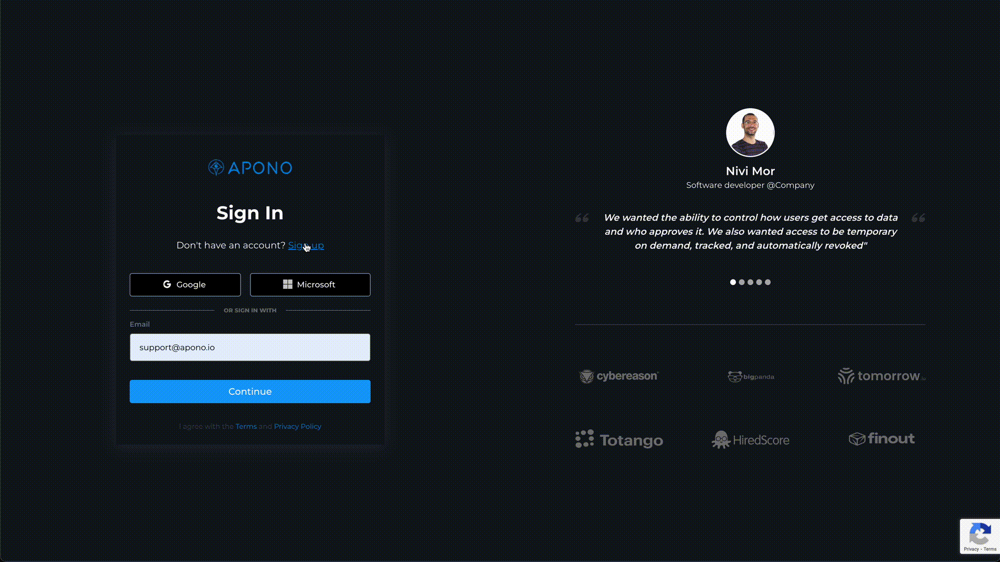

## Env setup

### Prerequisites
1. kubectl (https://kubernetes.io/docs/tasks/tools/)
2. minikube (https://minikube.sigs.k8s.io/docs/start/)

### Setup local env

1. Clone this repo to your computer

### Setup sample k8s cluster with data

1. Open a terminal window and start Minikube with the "apono-k8s" profile by running the following command:
    - `minikube start --profile apono-k8s`

2. Wait for the Minikube cluster to start. This may take a few minutes.

3. Once the cluster is running, switch to the "apono-k8s" profile by running the following command:
   - `minikube profile apono-k8s`

4. Verify that you're now using the "apono-k8s" profile by running the following command:
   - `minikube profile` (should output `apono-k8s`)

5. Set `apono-k8s` as default context for kubectl
    - `kubectl config use-context apono-k8s`

6. verify kubectl is connected to `apono-k8s` cluster
    - `kubectl get namespaces`

7. Setup sample k8s topology 
   - run `./k8s/scripts/k8s_warmup.sh` 

### Signup to apono app

1. go to <https://app.apono.io>

2. signup using your private or company email

