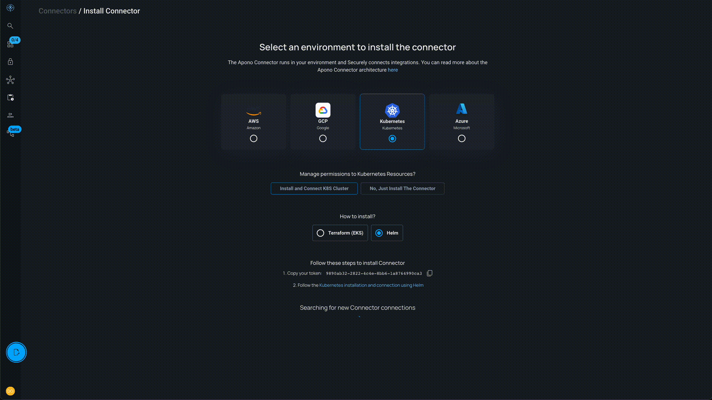

## Getting visibility

### Prerequisites
1. Good mood

### Connect the k8s cluster

1. Go to [Connectors Page](https://app.apono.io/connectors)

2. Click on `Create Connector`

3. Select `Kubernetes`, then select `Install and Connect K8s Cluster`, and then select Helm

4. Copy your token and follow the instructions link

5. Wait until you see a new connector is connected

### Check connected cluster

1. Go to connected integrations list [Integrations Catalog](https://app.apono.io/catalog/connected)

2. You should see your cluster there in `Active` status

3. You should also see the synced resources from the cluster

    * Those are not all the resources existing in the cluster, but those that Apono can immediately start managing access for you

### Getting some insights

1. Go to [Active Access](https://app.apono.io/active-access) page

2. At the top left, select your cluster from the integrations list

3. Click on `cluster-roles`, when view expands click on `admin` role

4. Now lets check which service accounts have this role

5. We discover that `rnd-data-team` have this role, which creates a big human mistake error surface on our cluster

   * This role was given to this team a while ago, when one of the developers was working on production incident fix

6. With Apono we can turn those team wide standing permissions into personal Just In Time access, lets see how in next section

7. You can play more with the cluster, see what else you can discover

