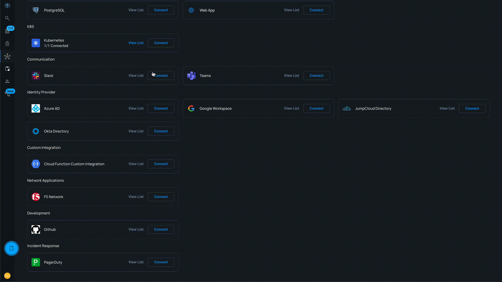
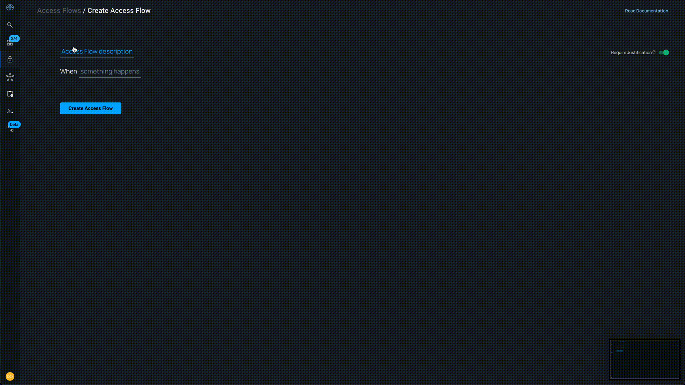
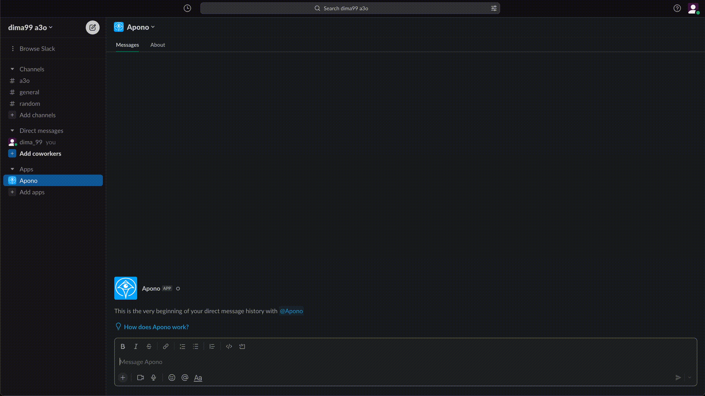

## Access Flow creation

Apono gives end users the ability to easily request access from the platforms the already use daily
`Slacl`, `Teams` and `CLI`

For this tutorial we will use `Slack`

### Create a Slack workspace

1. Go to [Slack](https://slack.com/get-started#/landing)

2. Click `Create a Workspace` and name it with some cool name

### Connect Slack workspace to Apono

1. Go to [Integrations Catalog](https://app.apono.io/catalog)

2. Scroll down for `Slack` and click `Connect`

   * you can quickly search it from the search bar on the top

3. On the slack page click `Connect` again

4. You will be redirected to slack consent screen to allow Apono connection

   * Make sure it connects with your recently created workspace

5. Click `Allow`

6. You will be redirected back to Apono, to `Connected Integrations` List, you should see `Slack` there with Active status

### Create an auto-approved access flow for Developers

1. Navigate to [Access Flows](https://app.apono.io/access-flows) page

2. Click `Create Access Flow` button

3. Name it `RnD Access to Customer data`

4. Select flow trigger: Click `something happens` and select `User requests access`

5. Select users to allow access for: Click `someone` -> `Users` -> your user

6. Select resources to allow access for:

   * Click `integration` and select you k8s cluster
   * Click `permissions` and select `edit`
   * Click `any resource`, select `by name` and then the customer namespaces `customer1`, `customer2` and `customer3`

7. Leave other fields as defaults

### Request Access

1. Go to [Slack web app](https://slack.com/)

   * Switch to your workspace if necessary

2. Click on `Apono` app in the `Apps` section

3. Type `/apono` in the message box and then Enter

4. Choose you cluster in the `Integration` selection (if not auto selected)

5. Choose `Namespaces` for the `Resource type`

6. Choose `customer1` from `Namespaces`

7. Choose `edit` from `Permissions`

8. Click `Submit`

9. You will receive and slack message notifying your of your request submission

10. Quickly after it will be replaced with your grant message containing your new credentials for the cluster

11. Click the `Access Details` button to view your credentials

12. Copy the command and run in your terminal, this will configure a new `kubectl` context named `k8s-k8s-apono-connector`

### Check the new credentials

1. Run `kubectl get pods -n customer1 --context k8s-k8s-apono-connector`

2. This should output the `mongodb` and `nodejs` pods running in that namespace

3. Try the same command with `cutomer2` namespace, this would fail
