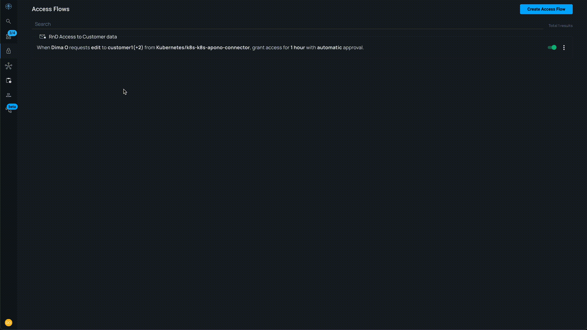
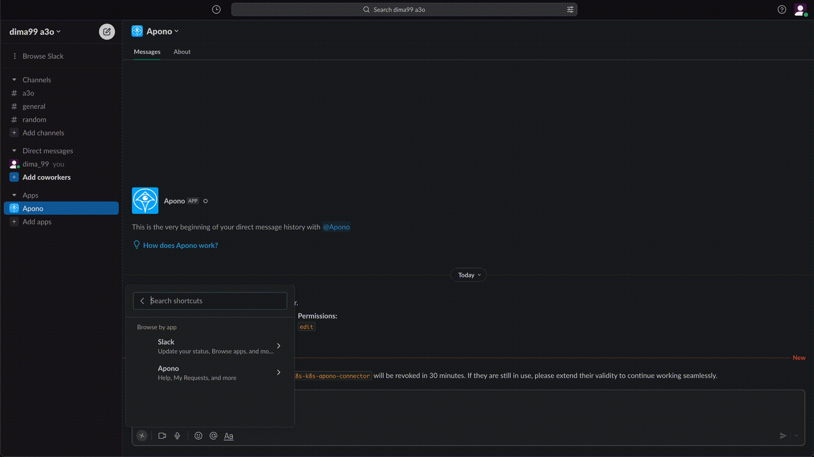

## Approval Access Flow

### Create an Access Flow with Approver 

1. Navigate to [Access Flows](https://app.apono.io/access-flows) page

2. Click on your `RnD Access to Customer data` access flow

3. Rename it to `Rnd Access to Infra`

4. Change the allowed resource to `data-pipeline` namespace

5. On the bottom line Click `automatic`, Select `Users` and select yourself, now you will be the approver for this access flow

   * Later you can select multiple users and/or groups once you connect you IDP to Apono

### Request Access

1. Go to [Slack web app](https://slack.com/)

   * Switch to your workspace if necessary

2. Click on `Apono` app in the `Apps` section

3. Type `/apono` in the message box and then Enter

4. Choose you cluster in the `Integration` selection (if not auto selected)

5. Choose `Namespaces` for the `Resource type`

6. Choose `customer3` from `Namespaces`

7. Choose `edit` from `Permissions`

8. Click `Submit`

9. Now you will get a notification about you request that is sent for approval

10. As you are also the approver, you will receive an approve request for this access request in your slack with all the details

11. Click on Approve

### Check the new credentials

1. Run `kubectl get pods -n data-pipeline --context k8s-k8s-apono-connector`

2. This should output the `rabbitmq` and `mysql` pods running in that namespace

3. Try the same command with `cutomer2` namespace, this would fail

### Review the Access from Apono

1. Go to [Activity Page](https://app.apono.io/activity)

2. You see all Access requests made in your account, their status and details

3. Click on the most recent access request to view it's detailed timeline

4. Now revoke this access request

   * Apono gives you full control of the access, in case it is no longer needed or need to be revoked you can simply revoke it from the App

5. Go back to you terminal and try to list pods again with `kubectl get pods -n data-pipeline --context <context_nane>`

